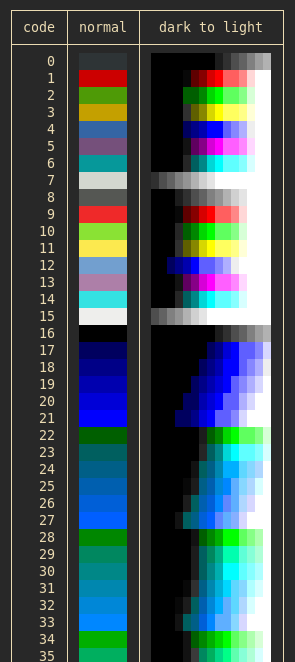

[![MIT][s2]][l2] [![Latest Version][s1]][l1] [![docs][s3]][l3] [![Chat on Miaou][s4]][l4]

[s1]: https://img.shields.io/crates/v/coolor.svg
[l1]: https://crates.io/crates/coolor

[s2]: https://img.shields.io/badge/license-MIT-blue.svg
[l2]: LICENSE

[s3]: https://docs.rs/coolor/badge.svg
[l3]: https://docs.rs/coolor/

[s4]: https://miaou.dystroy.org/static/shields/room.svg
[l4]: https://miaou.dystroy.org/3

Definition of ANSI, RGB and HSL color types and all the conversions between them.

There are many other color conversion crates.
This one is useful when you're interested into variations of an ANSI color for your TUI application, for example fading, lightening, darkening, with compatibility with terminals which don't support RGB.

The included example shows darken and lighten versions of all 240 ANSI colors:

